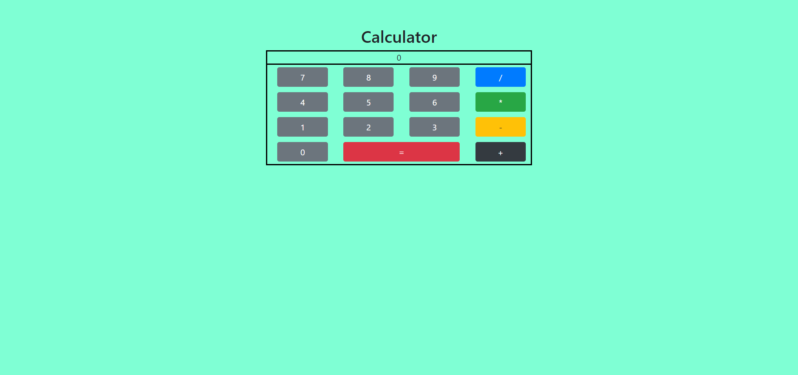

# Calculator
This project is an exploration of ES6 modules- import and export. I created basic calculator which has math functionality. It can add, subtract, multiply and divide numbers. 


## Screenshots


## How to run this project
* Use npm to install http-server in your terminal:
```
npm install -g http-server
```
* Run the server
```
hs -p 9998
```
* Open chrome and navigate to :
```
localhost:9998
```
